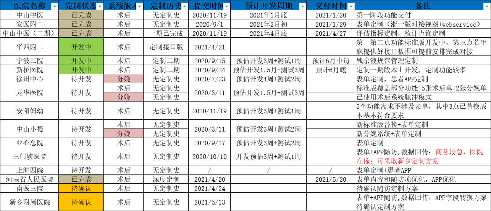

# 系统软件定制化信息

?>持续更新中... [如有错漏，欢迎指正~](chen.md)

<!-- 
| 医院名称     | 开发状态/排序 | 系统类别 | 定制历史       | 需求发起时间     | 预计开发周期        | 交付时间      | 备注                                   |
|----------|---------|------|------------|------------|---------------|-----------|--------------------------------------|
| 中山中医     | 已完成     | 术后   | 无定制史       | 2020/11/19 | 2021年1月底      | 2021/1/20 | 第一阶段功能交付                             |
| 安医附二     | 已完成     | 术后   | 无定制史       | 2020/9/1   | 2021年2月初      | 2021/1/29 | 表单定制（浙一版对接视图+webservice）             |
| 中山中医（二期） | 已完成     | 术后   | 一期已完成      | 2020/11/19 | 2021年4月底      | 2021/4/27 | 评估指标定制，统计查询定制                        |
| 华西附二     | 开发中     | 术后   | 定制接口版 | 2021/4/21  |               |           | 第一第二点功能标准版开发中，第三点若手麻提供好接口数据可提前安排完成对接 |
| 宁波二院     | 开发中     | 术后   | 定制二期       | 2020/9/15  | 预估开发3周+测试1周   | 预计6月中旬    | 残余液规范管理定制                            |
| 新桥医院     | 开发中     | 术后   | 定制二期       | 2020/9/24  | 预估开发1.5月+测试3周 | 预计6月底     | 定制一期版本上开发，定制功能较多                     |
| 徐州中心     | 待开发     | 分娩   | 无定制史       | 2020/7/23  | 预估开发4周+测试2周   |           | 表单定制，患者APP定制                         |
| 龙华医院     | 待开发     | 术后   | 无定制史       | 2020/3/11  | 预估开发1.5月+测试3周 |           | 标准版覆盖部分功能+5张术后单+2张分娩单                |
|          |         | 分娩   | 无定制史       |            |               |           | 已使用术后系统脉冲模式                          |
| 安阳妇幼     | 待开发     | 术后   | 无定制史       | 2020/11/19 | 预估开发3周+测试1周   |           | 5个功能需求不涉及表单，其中3点已替换版本基本符合要求          |
| 中山小榄     | 待开发     | 术后   | 无定制史       | 2020/3/11  | 预估开发3周+测试2周   |           | 新标准版替换+表单定制                          |
|          |         | 分娩   | 无定制史       |            |               |           | 新分娩系统+表单定制                           |
| 亚心总院     | 待开发     | 术后   | 无定制史       | 2020/9/17  | 预估开发3周+测试2周   |           | 表单定制                                 |
| 三门峡医院    | 待开发     | 术后   | 无定制史       | 2020/10/10 | 开发预估3周+测试1周   |           | 表单+APP随访,数据回传；商务较急，医院在催；可采取新乡定制方案    |
| 上海四院     | 待开发     | 术后   | 无定制史       | /          | /             | /         | 表单定制+患者APP                           |
| 河南省人民医院  | 已完成     | 术后   | 深度定制       | 2021/4/20  |               | 2021/5/20 | 表单内容和随访项优化，APP优化                     |
| 南医三院     | 待确认     | 术后   | 无定制史       | 2021/4/24  |               |           | 待确认随访定制方案                            |
| 新乡附属医院   | 待确认     | 术后   | 无定制史       | 2021/5/13  |               |           | 表单+APP随访,数据回传，APP字段转换方案待确认定制方案       |
-->